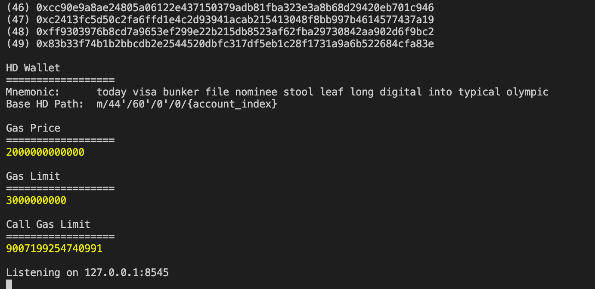
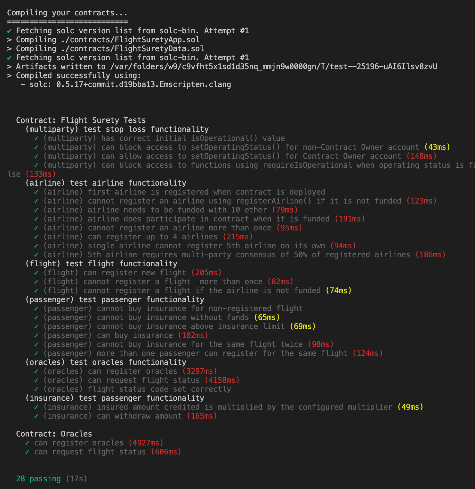

# Udacity Blockchain Developer Nanodegree Program - Project 8: FlightSurety

FlightSurety is a sample application project for Udacity's Blockchain course.

This repository contains smart contract code in Solidity (using Truffle), tests (also using Truffle), DApp (using HTML, CSS and JS) and server application.

## Install

To install, download or clone the repository and install all requisite npm packages (as listed in `package.json`)::

```
npm install
```

Fix the pragma in `node_modules/openzeppelin-solidity/contracts/math/SafeMath.sol`:

```
pragma solidity ^0.5.0;
```

Launch Ganache:

`ganache-cli --gasLimit 300000000 --gasPrice 20000000000 -a 50 -m "awake smooth flight dwarf same twist mosquito drip slab state fossil neutral"`

Your terminal should look something like this:



Test smart contracts:

`truffle test`

All 28 tests should pass.



## DApp

### Client

To use the Dapp:

```
npm run dapp
```

To view the DApp:

```
http://localhost:8000
```

### Server

```
npm run server
```

## Versions

- Truffle v5.0.18 (core: 5.0.18)
- Solidity - ^0.5.0 (solc-js)
- Node v10.15.3
- Web3.js ^1.2.10
